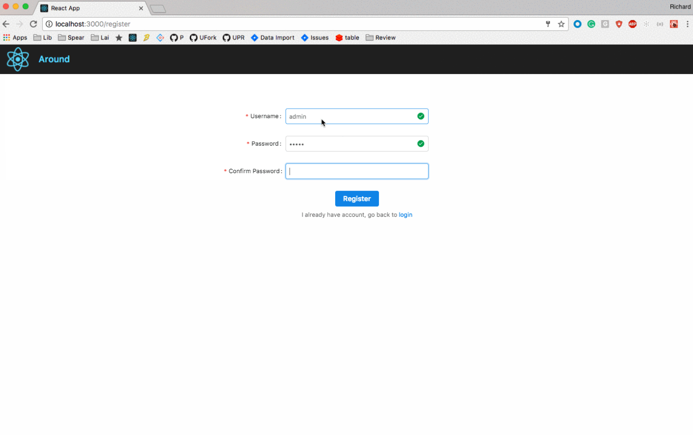
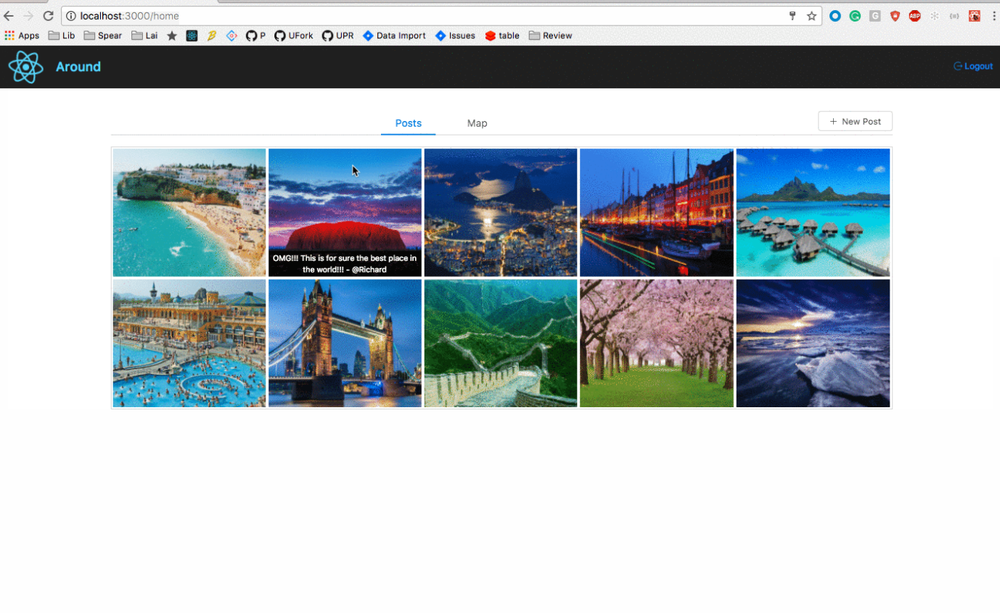
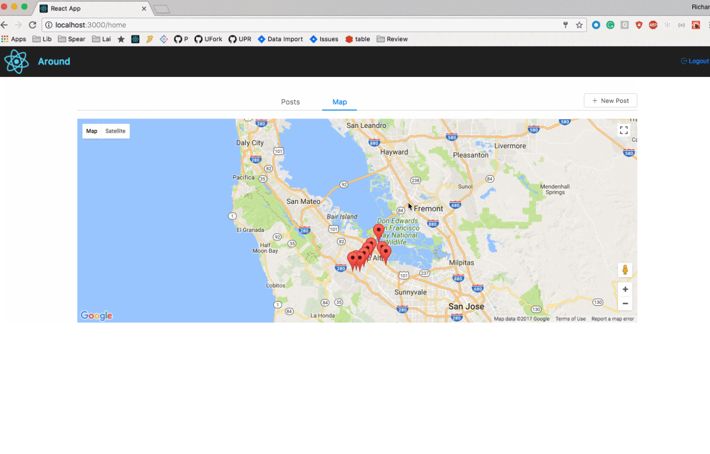

# GeoSocialNetwork Overview
This is a Geo-index based social network allow users find interesting posts within 200km based on their geolocation.

[#Demo](#Demo)

[#Features](#Features)

[#Dependencies](#Dependencies)

[#Contect](#Contect)

# Demo presentation:

## sign up

## homepage:

## maps:

# Features:
Front-end: React

Back-end: Go, GAE

Data: GCE, BigTable, BigQuery, Google cloud dataflow(Java-maven)

Authentication: Token based authentication

# Dependencies: 

## Utilized ElasticSearch (GCE) to provide geo-location based search functions such that users can search nearby posts within a distance
<h2>Backend - Go</h2>

Used Go to handle http requests, implemented funcs like post and search basde on google cloud elastic search.

dependencies:

<ul>
  <li>cloud.google.com/go/bigtable</li>
  <li>cloud.google.com/go/storage</li>
  <li>github.com/pborman/uuid</li>
  <li>gopkg.in/olivere/elastic.v3</li>
  <li>github.com/auth0/go-jwt-middleware</li>
  <li>github.com/form3tech-oss/jwt-go</li>  
  <li>github.com/gorilla/mux</li>  
</ul>  

## Daily dump of posts tp BigQuery table for offline analysis

<h2>Maven - Java</h2>

Use Maven to manage build configurations and dependencies.

dependencies:

<ul>
  <li>google-api-services-bigquery</li>
  <li>google-http-client</li>
  <li>guava-jdk5</li>
  <li>google-api-services-pubsub</li>
  <li>guava</li>
</ul>  

# Contect 
Email :  zzcjob397@gmail.com
